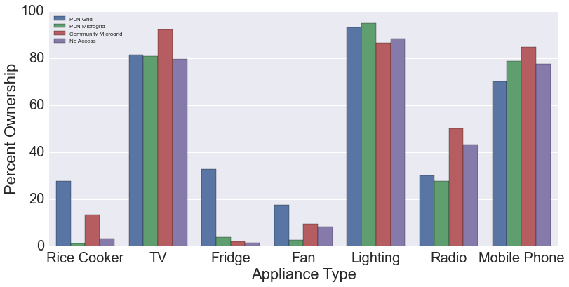
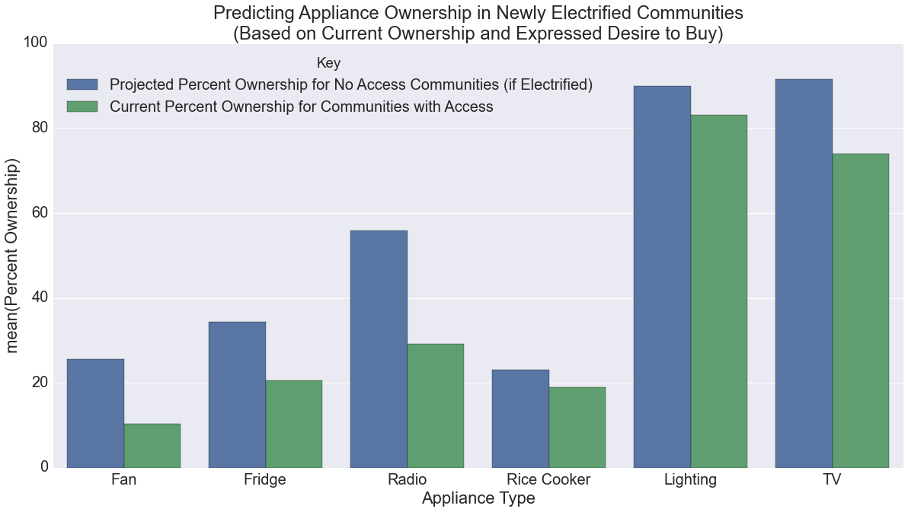

# Possible Titles
- Multiple estimates of latent demand using survey data
- Appliance acquisition after electricity provision

# Abstract

- in remote areas, electricity provision must be financially viable
    without subsidy
- we explore methods to predict appliance acquisition to provide a
    bottom up model for electricity demand
- these methods provide a range of estimates to be corroborated by
    future work

# Introduction

## Global Topic

- global electricity access is poor
- many areas require private capital to install electricity
- part of problem is upfront investment cost
- due to perceived business risk, upfront capital is costly (citation)

## Oversizing

- oversized microgrids based on overestimated demand that cannot meet
    revenue targets contribute to this perception
- Schnitzer has shown the consequences of generators with excess
    capacity on microgrid operation
    - EPP thesis work chapter three
- to avoid excess capacity, systems must be sized appropriately
- accurate sizing requires accurate demand estimation
- estimating demand in areas without access is challenging
- through more accurate appliance estimation, we may achieve more
    accurate energy estimation
- with more accurate energy estimation, a micro-utility can reduce
    the variance in revenue
- reductions in revenue variance should lead to lower-cost capital
- we explore methods for bottom up estimation of appliance ownership
    after electrification

## Contribution

- more accurate forecasting of appliance purchases, use, and resulting
    electricity demand can improve financial performance by improving
    the procurement of power generation equipment
- we use surveys of rural households to create a village level forecast
    of appliance acquisition after electrification
- this appliance forecast can be used to create a bottom-up model of
    electricity demand (cite World Bank Policy Research Working Paper
    4866)
- in the short term, we do not use top-down as we do not expect the
    availability of electricity to significantly influence income

## Study Detail

- we use a survey provided by Advancing Energy and Cenderwash University
- this is a subset of households planned to be electrified in the near
    future allowing for follow up visits
- data set with similar communities with and without access
- survey taken to understand electricity demands and interests
- do you currently own appliance X?
- if electricity available, will you buy appliance X?
- we demonstrate several approaches to estimating eventual ownership
- full details will be provided in the Methods section

## Related Work

- other studies have made forecasts of electricity demand
- Wolfram et al have used an econometric approach to predict the
    appliance acquisition as communities encounter wealth
- the wolfram study forecasts appliance purchases stimulated by
    increases in wealth
- Jay Taneja IBM Nairobi paper shows district based approach to village
    pairing strategy
- We augment this pairing strategy with desire to buy
- this study forecasts energy demand by comparing similar villages
    before and after a connection to electricity

# Method

## Assumptions
- We do not have random sampling
- We do not consider economic effects since we don't observe significant
    income variations in previously connected areas
- Electricity won't significantly influence disposable income
- Households dominate microgrid energy and power demands

## Survey Description
<!-- TODO: look through summer 2014 notes for appliance schnitzer notes -->
- survey supplied by collaborators from AE and Cenderwash University
- survey designed by AE
- data collected by CU students
- data collected and hosted online
- data collected in a single tabular store for analysis
- N = 1184

## Appliance ownership

- We observe the overall reported percentage of household reporting
    ownership of each appliance (fig or table)
- We then split the dataset and assign each village to an access type
    (grid, microgrid, no central access)
- We observe the reported percentage of appliance in each access type
- We expect to find devices that require more energy only in grid
    locations
- We don't expect to find high energy use appliances in areas without
    central access
- We observe a low variation for TV, lighting, and mobile phone
    ownership across access types
- We observe higher variation for rice cookers and refrigerators with
    ownership concentrated in areas with grid connections
- We observe variation in radio ownership with concentration of
    ownership in off-grid and community run microgrid areas
- bar chart
- include number of observations as part of x-axis label?
- label: appliance_ownership_by_access_type

<!-- mattrosi/2015&#45;08&#45;26&#45;App&#45;Own&#45;Grid_Type.ipynb -->

## Surveyed Appliance Desire

- we provide an estimate of post-electrification appliance ownership
    using the survey responses
- for low electricity-access areas, add the population currently
    owning a given appliance to the population that doesn't currently
    own one but claims that they will buy
- This should be relatively constant over access types but our data do
    not show that
- Show bar chart with numbers
- label: appliance_desire_to_buy_by_access_type

## Electrified estimate of appliance ownership

- we also estimate ownership by measuring the ownership of appliances in
    a similar but previously connected village
- we assume that newly connected villages will eventually resemble
    previously electrified villages
- approach two: match villages by other characteristics and find the
    levels of appliance ownership in the connected villages most like
    the unconnected villages.  (we focus on high consumption
    appliances.)  this requires a set of matching criteria.  first
    strategy is to find factors that reduce the variance in ownership
    stats
- Based on the stated desire of survey responses, we can estimate the
    eventual number of appliance owners by appliance category
- estimate increased appliance purchases
- estimate resulting increase in energy usage
- compare results from approaches

## Comparison of preferences and matched villages

- we can compare these two approaches
- show differences in percentage forecast by access type
- side by side box or violin plot with dots
- The stated desire to buy provides a higher estimate than the
    previously electrified villages
- x-axis access type
- color forecast method
- y-axis percentage ownership after electrification
- label: appliance_ownership_desire_comparison

## Bottom up estimation ranges

- using these approaches, we can bound estimates of energy and power
    usage for households and villages
- we can also create a time series estimate of electricity usage for a
    village

## Probability distributions

<!-- TODO: this needs more of a motivation -->
- approach three: create probability distributions by treating as an
    ensemble of bernoulli probabilities.  you can then create a
    distribution of energy consumptions.
- this allows us to move beyond a point estimate

# Results

- Quantify levels of generator usage observed in no access regions
- TV and lighting above X% in all areas with little variation
- television ownership observed in locations without electricity
    - plot of TV ownership overall, and by access type
    - AE 1.01.10 is related
- Stated preferences for appliance purchases do not match current
    ownership levels in grid regions
- These provide some point estimates of eventual ownership levels

# Future Work
- Understanding the amount of shared generation
- Understanding how TV is powered and the cost of that
- What is the least cost temporal provision of assets for these
    locations?  We borrow from the current utility planning literature.
- Using measured microgrid data to test estimates

